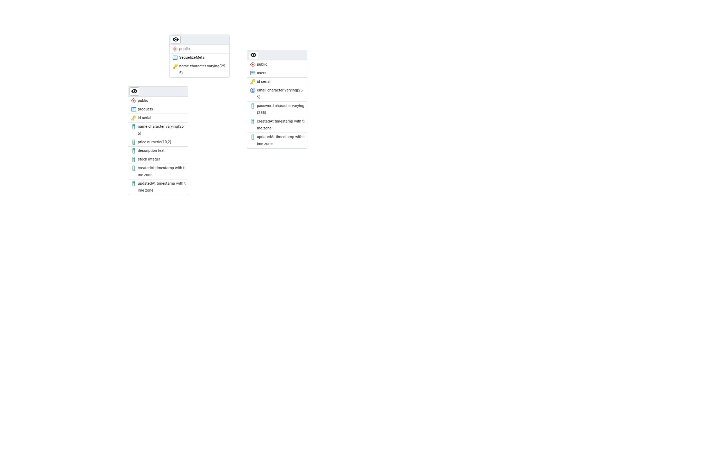

# Product Management System - Backend API

RESTful API untuk sistem manajemen produk yang mencakup fitur **login, register**, dan **CRUD produk**.

##  Tech Stack

- **Backend**: Express.js  
- **Database**: PostgreSQL  
- **ORM**: Sequelize  
- **Authentication**: JWT 

## ERD




## Running Apps Locally

### 1. Clone dan Install Dependencies

```bash
git clone https://github.com/Arbyusman/BE-product-management-system.git
cd BE-product-management-system

npm install
# atau
yarn install
```

Buat file .env atau copy file .env-example di root project:

```
DB_USER=
DB_PASSWORD=
DB_HOST=127.0.0.1
DB_NAME=
DB_PORT=5432

JWT_SECRET=

APP_PORT=8080
```

### Setup database
```bash npm run create       # Membuat database
npm run migrate      # Menjalankan migrasi
npm run seed         # Mengisi data awal (user & produk)
```

### default user
```
{
  "email": "admin@mail.com",
  "password": "ad,in!"
}
```


## Project structure

```
.
├── app                          # Folder utama untuk logika aplikasi
│   ├── controllers              # Mengelola permintaan dari client dan mengarahkan ke service
│   │   └── api
│   │       └── v1
│   │           ├── authController.js    # Mengelola login dan register
│   │           └── productController.js # Mengelola operasi CRUD produk
│   ├── middlewares              # Middleware untuk autentikasi JWT
│   │   └── auth.js
│   ├── models                   # Definisi model Sequelize untuk tabel database
│   │   ├── product.js
│   │   └── user.js
│   ├── repositories             # Abstraksi query database untuk produk dan user
│   └── services                 # Logika bisnis untuk autentikasi dan produk
├── bin
│   └── www                      # Entry point untuk menjalankan server Express
├── config
│   ├── database.js              # Konfigurasi koneksi database
│   └── routes.js                # Daftar routing aplikasi
├── db
│   ├── migrations               # File migrasi untuk membuat tabel database
│   └── seeds                    # Data awal yang diisi ke dalam database
├── jest.config.js               # Konfigurasi untuk Jest testing
├── package.json                 # File konfigurasi NPM berisi dependencies dan script
├── .env                         # File konfigurasi environment
└── README.md                    # Dokumentasi proyek
```


## API EndPoint

| Method | Endpoint               | Deskripsi                        | Auth Required |
| ------ | ---------------------- | -------------------------------- | ------------- |
| POST   | `/api/v1/register`     | Registrasi user baru             | No            |
| POST   | `/api/v1/login`        | Login dan mendapatkan token      | No            |
| GET    | `/api/v1/products`     | Menampilkan semua produk         | Yes           |
| POST   | `/api/v1/products`     | Menambahkan produk baru          | Yes           |
| PUT    | `/api/v1/products/:id` | Memperbarui data produk          | Yes           |
| DELETE | `/api/v1/products/:id` | Menghapus produk                 | Yes           |
| GET    | `/api/v1/whoami`       | Menampilkan data user yang login | Yes           |


